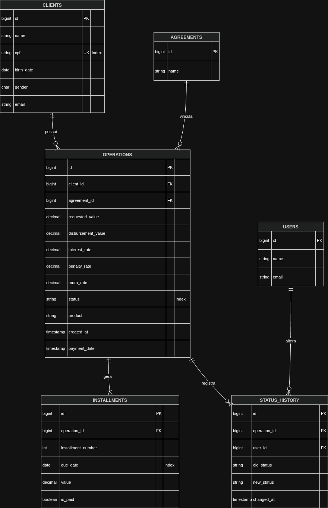

# Modelagem do Banco de Dados

Resumo da modelagem do banco de dados para o sistema,
incluindo as principais entidades, seus atributos e os relacionamentos entre elas.

Convenção de nomenclatura: [Convenção de Nomenclatura](https://gist.github.com/thiamsantos/654ec002f04c86d53611923a8b4c3a65).

Para mais detalhes sobre o projeto, consulte o [README.md](../README.md).

---

## Diagrama Entidade-Relacionamento (DER)

### 1. Clients (Clientes)
- `id`: PK, BigInt
- `name` Varchar(255)
- `cpf` Varchar(11), Unique, Index
- `birth_date` Date
- `gender` Char(1) ('M' para masculino, 'F' para feminino, 'O' para outros)
- `email` Varchar(255)

### 2. Agreements (Conveniadas)
- `id` PK, BigInt
- `name` Varchar(255)

### 3. Operations (Operações)
- `id` PK, BigInt
- `client_id` FK, BigInt
- `agreement_id` FK, BigInt
- `requested_value` Decimal(15,2)
- `interest_rate` Decimal(5,2)
- `status` Varchar(30), Index 
  ('DIGITANDO', 'PRÉ-ANÁLISE', 'EM ANÁLISE', 'PARA ASSINATURA'
  'ASSINATURA CONCLUÍDA', 'APROVADA', 'CANCELADA', 'PAGO AO CLIENTE')
- `product` VARCHAR(20) ('Consignado' ou 'Não consignado')
- `payment_date` Timestamp, Nullable

### 4. Installments (Parcelas)
- `id` PK, BigInt
- `operation_id` FK, BigInt
- `installment_number` Int
- `due_date` Date
- `value` Decimal(15,2)
- `paid` Boolean, Default false

> Em `gender`, `status` e `product`, 
  foram utilizados tipos de dados que permitem uma validação mais fácil e permitir
  a extensibilidade futura, caso seja necessário adicionar novos valores.
> 
>  Se fosse utilizado o tipo `ENUM` do MySQL, a adição de novos valores exigiria 
  uma alteração na estrutura da tabela, 
  o que pode ser problemático em ambientes de produção, principalmente em tabelas com
  muitos registros, o que poderia deixar o Banco de Dados fora do ar por minutos.

---

## Relacionamentos

- Um cliente pode ter várias operações (1:N)
- Uma operação pertence a um cliente (N:1)
- Uma operação pertence a uma conveniada (N:1)
- Uma conveniada pode ter várias operações (1:N)
- Uma operação pode ter várias parcelas (1:N)
- Uma parcela pertence a uma operação (N:1)

---

## Diagrama de Entidade Relacionamento (DER)

 

